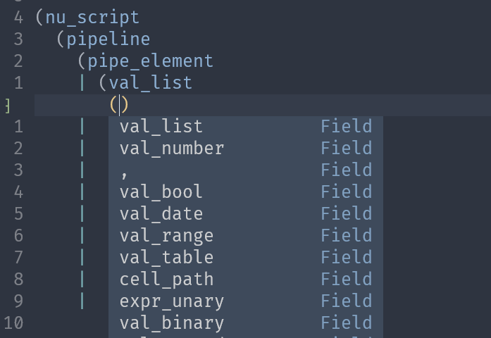
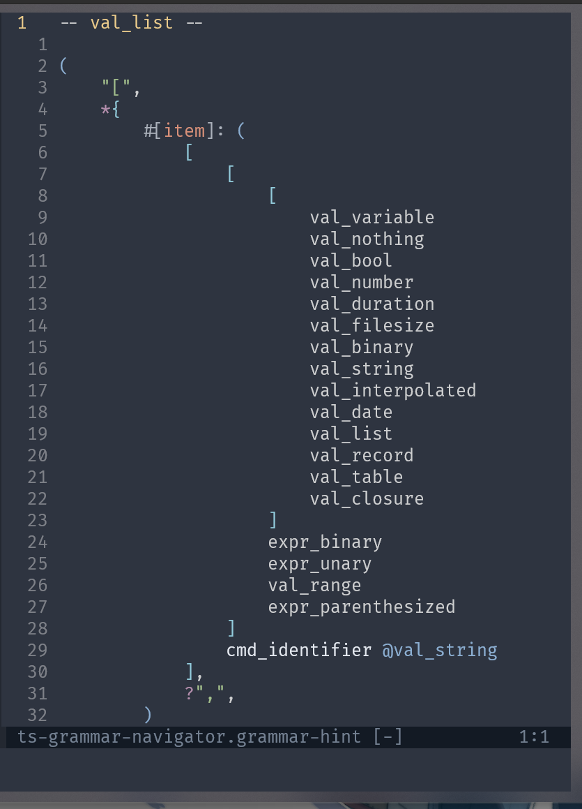

# tree-sitter Grammar Navigator

This plugin is aming at making humand unfriendly tree-sitter test easier to write
by hand.

This plugin was born yesterday, you may encounter bugs.

It provides  three feature:

1. Auto completion for children of a rule when writing test case;
2. Display syntax token of current parent rule on a side panel;
3. S expression formatting.

If your are using packer as your package manager, you can install it like this:

```lua
use {
    "SirZenith/ts-grammar-navigator",
    requires = {
        "SirZenith/panelpal.nvim",
        "hrsh7th/nvim-cmp",
    },
}
```

## Auto completion

This plugin register a `nvim-cmp` source, completion functionality is provided
by `nvim-cmp`. So if you haven't install it yet, you might want to take a look
at [this](https://github.com/hrsh7th/nvim-cmp).

After install `nvim-cmp`, add following source name to `nivm-cmp` completion
source list:

```lua
local cmp = require "cmp"
cmp.setup({
    sources = cmp.config.sources({
        { name = "tree-sitter-grammar" }
    })
})
```

When you open neovim or change directory in neovim, this plugin will look for
`grammar.js` and `src/node-types.json` in your working directory.

I such file exists, when you start writing test case, you will find completion
list pop up every time you type `(` in a S expression.

This plugin will looks for closest open parent from your cursor position, and
provides you all its child name in completion list.

For example, when you type `(source (statement) (`, after your last `(` input, you
will see a list of `source` rule's children.

Your `src/node-types.json` file might get updated when you run `tree-sitter generate`,
then if you want completion to uses latest `node-types.json` content, you need
to run `TSNaviReload` command.



## Syntax Token Hint

This plugin provides `TSNaviShowHint` and `TSNaviHideHit` command to show or hide
grammar hint panel.

When you run `TSNaviShowHint`, a split buffer will show up on right half of you
editor.

Similar to auto completion, hint panel requires `grammar.js` and `src/grammar.json`
exists in you working directory. And uses the same `TSnaviReload` command to
update grammar data.

Every time you type in after a open parenthesis, hint panel's content will update
to token info of nearest open parent.

`[]` means choice, `()` is sequence, `*{}` and `+{}` are repeat and repeat1 recpectively.
optional token is prefixed with `?`, string or regex token are displayed as quoted
string. Field name is displayed as `#[name]`, alias is shown as `rule-name @alias-name`.



## Test Case formatting

`TSNaviFormatFile` and `TSNaviFormatSelection` are commands for S expression
formatting. I personally use them with keymap.

```lua
vim.keymap.set("v", "<A-F>", function()
    vim.cmd "TSNaviFormatSelection"
end)

vim.keymap.set("n", "<A-F>", function()
    vim.cmd "TSNaviFormatFile"
end)
```

`TSNaviFormatSelection` command does not take range input, so please don't try
to call it directly, use a keymap instead.
